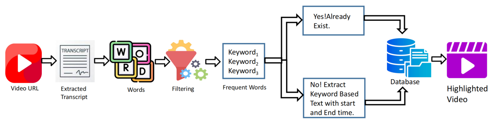

<h1 align="center">ClipXpert: Automated Clip Mining from Video Data for High-Demand Content</h1>

<p align="center">
  <a href="https://ieeexplore.ieee.org/document/10969233"></a>
  <a href="#"></a>
  <a href="#"></a>
</p>

---

## 📖 Abstract
ClipXpert is a new system that automates the extraction of relevant clips from YouTube videos using user-defined keywords or frequently used word or comment analysis. The system uses advanced transcription models to search a pre-existing database for lines associated with the provided keywords. If the database doesn’t contain the keywords, it dynamically identifies and stores relevant content for future use. ClipXpert also automates identifying frequently used nouns, adjectives, and adverbs to generate focused content highlights without user intervention. It also performs sentiment analysis on YouTube comments to understand audience engagement and reception. ClipXpert enhances video content extraction efficiency and accuracy, catering to the growing demand for targeted, high-value clips in the digital media landscape.

---

## 🚀 System Overview



---

## ✨ Key Features
* **Keyword-Based Extraction:** Automatically finds and clips video segments based on user-defined keywords.
* **Dynamic Database:** If keywords are not found, the system dynamically identifies and stores relevant content for future searches.
* **Automated Highlight Generation:** Generates content highlights by identifying frequently used nouns, adjectives, and adverbs without user input.
* **Sentiment Analysis:** Analyzes YouTube comments to gauge audience engagement and reception for specific topics.

---
## 🎬 Output Video Example

Here’s an example of **ClipXpert** in action for keyword-based video extraction and subtitle generation:

- **Original Video:** [17-minute full video](https://youtu.be/VQluL1IRDbY?si=PRtD4hCodDnf8_-)  
- **Keyword Highlight:** `IELTS`  
- **Description:** The output video automatically extracts all lines containing the keyword **“IELTS”** spoken by **Fastrack IELTS**. ClipXpert generated a **27-second highlighted video** containing these segments with subtitles and timestamps.  
- **Watch the Highlighted Output:** [Highlighted Video](https://youtu.be/BUxIEMN66HU)

---


## 📄 Citation
If you find our work useful for your research, please consider citing our paper.

**Paper Link:** [**Click Here**](https://ieeexplore.ieee.org/document/10969233)

### BibTeX
```bibtex
@INPROCEEDINGS{10969233,
  author={Chatterjee, Rajdeep and Chakrabarty, Sudip and Bishwas, Pappu},
  booktitle={2025 3rd International Conference on Intelligent Systems, Advanced Computing and Communication (ISACC)}, 
  title={ClipXpert: Automated Clip Mining from Video Data for High-Demand Content}, 
  year={2025},
  volume={},
  number={},
  pages={13-18},
  keywords={Sentiment analysis;Video on demand;Accuracy;Machine learning;Media;Real-time systems;Web sites;Data mining;Intelligent systems;Videos;Clip mining;video segmentation;keyword based video extraction;high-demand content},
  doi={10.1109/ISACC65211.2025.10969233}}
```
